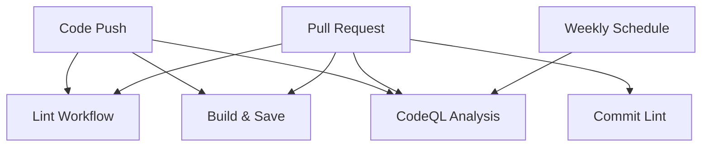

# GitHub Actions Workflows

This document provides comprehensive documentation for all GitHub Actions workflows used in the StrengthTracker project.

## Overview

The project uses four main GitHub Actions workflows to ensure code quality, security, and build automation:

1. **Build & Save Artifacts** - Builds and archives application artifacts
2. **CodeQL Analysis** - Performs static security analysis
3. **Commit Lint** - Ensures commit message conventions
4. **Code Linting** - Maintains code quality standards

## Workflows

### [Build & Save Artifacts](./workflows/buildnsave.md)
- **Purpose**: Builds both backend (Java/Maven) and frontend (Angular) components
- **Triggers**: Push and pull requests to main branch
- **Artifacts**: JAR files and frontend distribution files
- **Retention**: 7 days

### [CodeQL Analysis](./workflows/codeql.md)
- **Purpose**: Static security analysis for Java and TypeScript code
- **Triggers**: Push, pull requests, and weekly schedule
- **Languages**: Java, TypeScript
- **Security**: Identifies potential vulnerabilities

### [Commit Lint](./workflows/commit-lint.md)
- **Purpose**: Enforces conventional commit message format
- **Triggers**: Pull request events
- **Standards**: Follows commitlint conventions
- **Integration**: Uses project's commitlint.config.js

### [Code Linting](./workflows/lint.md)
- **Purpose**: Maintains code quality standards
- **Triggers**: All pushes and pull requests
- **Tools**: Maven Spotless (Java), ESLint (TypeScript/Angular)
- **Standards**: Automatic code formatting and linting

## Workflow Dependencies

## Best Practices

- All workflows run on Ubuntu latest for consistency
- Proper artifact retention policies (7 days)
- Security-focused permissions
- Language-specific optimizations
- Comprehensive error handling

## Maintenance

- Review workflow performance monthly
- Update action versions quarterly
- Monitor artifact storage usage
- Adjust retention policies as needed
